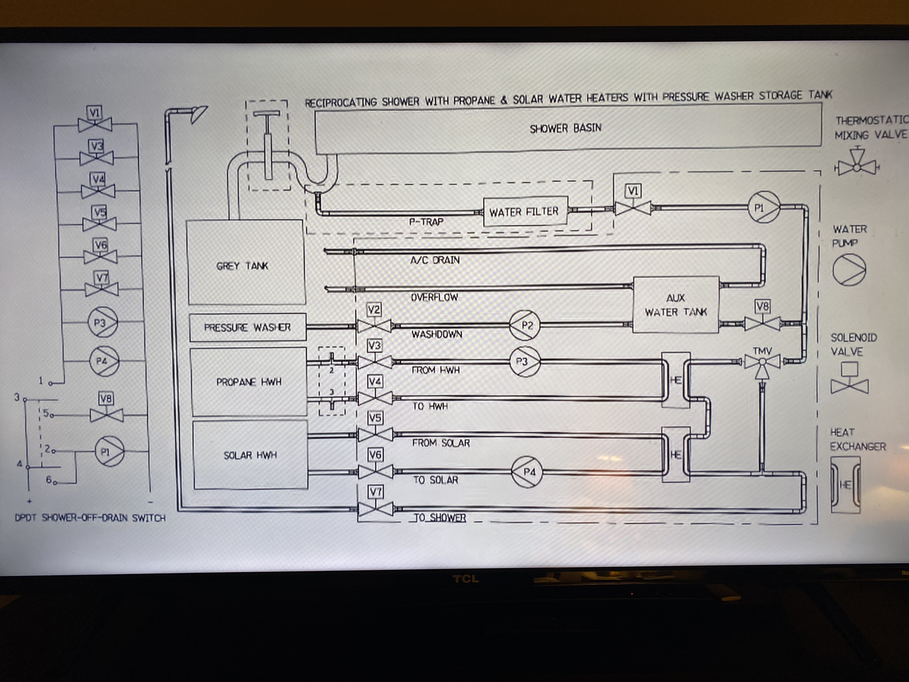
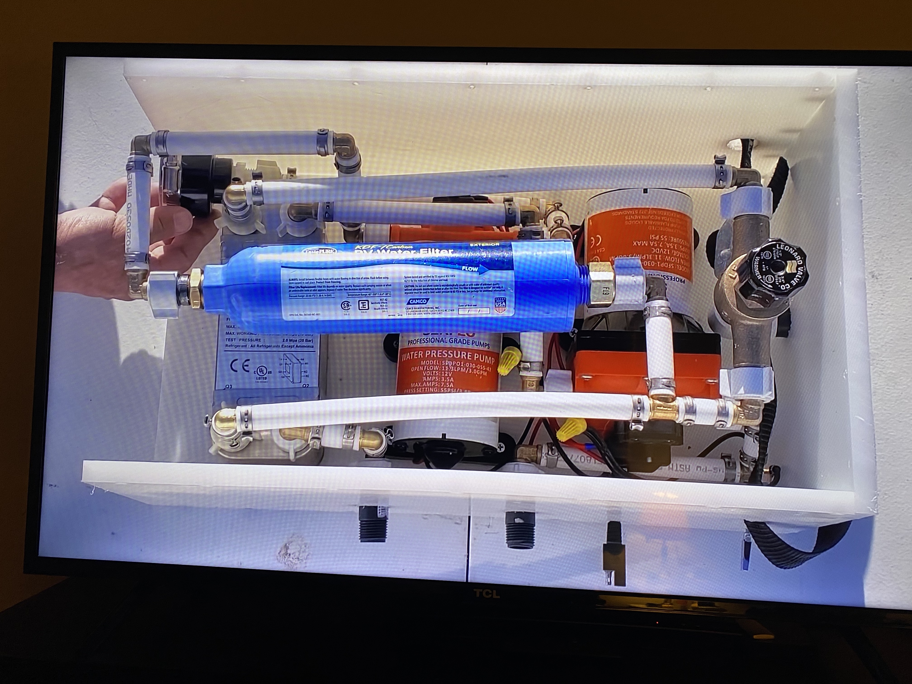

# Heated Hour Shower
*For off grid low water availability in RVs, vans, and off grid housing.*

## Why

When Boondocking without a connection to water any water you have is valuable and in low supply. One gallon of water weighs 8.34 pounds. If you have a large 40 gallon water tank that will be 333.6 pounds. That's a lot of weight to carry around. The problem is you will most likely need more than 40 gallons of water if you take showers.

If you take a navy shower where you wet yourself down, pause the flow of water, soap up, then rinse off you're using about 3.5 gallons of water for each shower. More if you wash your hair. That's around 11 showers or less if you have a 40 gallon tank. If there are two of you that's around 5 days of showers. The problem is that you don't just use your water for showers. You wash dishes, your hands, you drink water, your pets drink water, you wash your pets with water, and more. 

If you decrease your shower water usage from 3.5 gallons of water for each navy shower down to a half gallon per shower, for two people that's a gallon per day (less if you share a half gallon of water). Now you have 40 days of showering for two people with a 40 gallon freshwater tank. That frees up 3 gallons of water that you would use if you took a navy shower for other uses. 

The hour shower is a filtered recirculating water shower that allows you to take long luxurious clean hot showers while reducing your water usage, allowing you to stay off grid longer without having to refill your freshwater tank.

## Partial List of Parts

- 2 Seaflo Dual 42 Series 12V 6.0 GPM 55 PSI Water Pressure Diaphragm Pump System with Internal Bypass Valves to reduce cycling https://www.amazon.com/dp/B0788SRVRM/ref=cm_sw_r_cp_api_glt_fabc_6KRZAGDF0WN3M5VWX9GT

- DRAMM 400 WATER BREAKER NOZZLE, BLACK https://www.amazon.com/dp/B000BX4REQ/ref=cm_sw_r_cp_api_glt_fabc_MZ3Y978BH5MMC9T02CP9

- Used as a heat exchanger
HFS(R) Homebrew Beer Wort Chiller (7.5'' 2.9''/20 plate, 1/2" x 1/2" NPT) https://www.amazon.com/dp/B06Y41HCFP/ref=cm_sw_r_cp_api_glt_fabc_1N5YZYYFJESZ3SPM8GKE

- Thermostatic Mixing Valve with 1/2 NPT Male Connections,Water Temperature Control Valve,Solid Brass https://www.amazon.com/dp/B08L17P49P/ref=cm_sw_r_cp_api_glt_fabc_B00ZSKH77YJFC0DZHND5

- PIH High Pressure RV Handheld Shower Head Unit with Powerful Shower Spray w/Pause Setting, Multi-Functions, Bathroom Accessories w/ 59'' Hose, Bracket, Hose Clock https://www.amazon.com/dp/B0713MVT1M/ref=cm_sw_r_cp_api_glt_fabc_9C03CDSEPAHBPP071B58

- Camco 40043 TastePure RV/Marine Water Filter with Flexible Hose Protector | Protects Against Bacteria | Reduces Bad Taste, Odors, Chlorine and Sediment in Drinking Water https://www.amazon.com/dp/B0006IX87S/ref=cm_sw_r_cp_api_glt_fabc_TMQ6JS250TQS4PTT4PY3

- SPARKING 12FT SAE Extension Cable 16AWG- SAE to SAE Extension Cord, SAE 2Pin Bullet Quick Connect 16awg Heavy Duty Wire Harness with Waterproof Cap https://www.amazon.com/dp/B0746DX2L1/ref=cm_sw_r_cp_api_glt_fabc_WVVZC92NZB550YTA6WMT

You’ll still need some sort of box to put it in and there are a couple of parts missing.

You need to get some sort of screen to clamp over the intake nozzle to filter out hair and other large particles.

Whatever material you use for pipes must be flexible since the pumps vibrate and your RV/van vibrates while traveling.

Also, I like the version 2.0 use of an anti-scald single handle shower control unit. You can see that in the video for the 2.0 version.

## How to Use
Use 1/2 gallon of water per shower in the shower pan. 

Add 1 teaspoon of Epson salt to the water. This will get rid of the suds.

- Amazon Brand - Solimo Epsom Salt Soak, Magnesium Sulfate USP, 8 Pound https://www.amazon.com/dp/B07NJPMVG9/ref=cm_sw_r_cp_api_glt_fabc_A9CEWW40DWNK338EYEBQ

Turn on the 12v DC source.

Take your shower for as long as you have 12 V and heated fluid source.

When using the hour shower make sure that you use a neutralizing/biodegradable soap that does not contain any petroleum products. This will also help the filter to last longer before the need to be replaced.

- Puracy Natural Body Wash, Bergamot & Sandalwood, Skin Softening Bath & Shower Gel for Men and Women with Coco Glycinate, 16 Fl Oz (2-Pack) https://www.amazon.com/dp/B07QHGS28Q/ref=cm_sw_r_cp_api_glt_fabc_00T273Q45NB5HJ9CTXNJ?_encoding=UTF8&psc=1

When you have completed your shower. 

Turn off the 12v DC source.

You can dump the half gallon of water into your gray tank or save the recycled shower water to wash your solar cells.

## Diagram 

This diagram shows you how you might integrate the heated hour shower in an existing RV. It comes complete with multiple heat sources and automation.

It was created by the original person who created the heated hour shower at the apparently orphaned Gone Boondocking YouTube channel. 

We will be using a simplified version of the Heated Hour Shower. 

## Inside the hour shower v2.0.

This will show you what you need to create the heated hour shower and where everything goes.

1. The water in the shower pan is sucked up through the DRAMM 400 water breaker nozzle with clamped on screen (held by hand in picture) to the inlet side of the lower pump.

2. It is then sent through the filter.

**The water is now clear and clean!**

3. The water then goes to a T that sends the water to the cold side of the anti-scald valve and cold side of the heat exchanger. 

4. Once through the heat exchanger the water goes to the hot side of the anti-scald valve.

5. The anti-scald valve regulates the temperature of the water and sends the heated water to the shower head out the top of the box.

How the water is heated using an external source.

1. Heated fluid (water or glycol) goes into the inlet side of the heat exchanger.

2. The fluid exits the heat exchanger to the inlet side of the top pump.

3. Then goes back to the heat source that reheats the fluid.

The heated fluid source could be a hot water heater with a T in the inlet to accept returning heated water or it could be a heater or antifreeze from your RV engine.  

At the bottom of the image (left to right) are the heated fluid inlet, outlet, and 12v DC source.

Using a heat exchanger allows you to keep heated freshwater or glycol separated from the recycled shower water.

## The completed hour shower v2.0.

## Videos 

Diagram and tips explained to permanently install the hour shower in your RV/van. This video also explains the scientific reason for using Epson salt and also why you'd want to use biodegradable soap.

https://youtu.be/oGznaA2qIbQ

The heated hour shower in action.

https://youtu.be/8s3jsleHXcI

